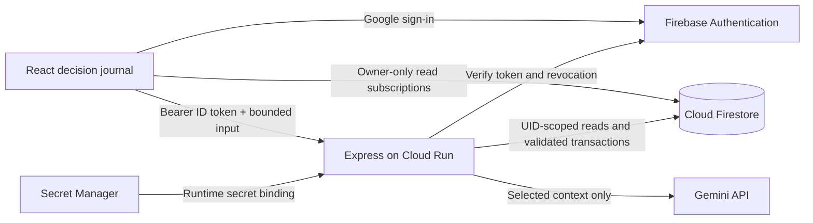

# Foresight

A private decision journal for students and early-career users: **clarify a choice, try a small experiment, review the outcome, and carry the evidence forward.**

Implementation is present. Automated tests, builds, type checks, browser validation, live service configuration, and deployment have **not** been completed as part of this implementation. Do not represent the app as production-validated until the checks below have been run.

## The product

- A conversation with Gemini and an editable brief make options, priorities, constraints, assumptions, and unanswered questions visible.
- A dedicated journal turns free-form writing into a private, mode-specific Gemini reflection. Users can continue the conversation or carry an entry into the decision workflow without retyping it; earlier Gemini Reflections entries remain available in the same timeline.
- Journal search, tags, and a month calendar connect pages with decisions over time. Browser-native voice dictation remains editable before it is saved or shared with Gemini.
- A dependency-free knowledge graph maps journal pages, decisions, tags, selected evidence, and Gemini pattern citations. Users can pan, zoom, search, filter, inspect, and open connected records.
- Authenticated exports provide a readable Markdown journal or complete JSON data copy. Individual entries and all stored user data can be permanently deleted with explicit confirmation.
- A commitment records the choice, reasoning, expected outcome, confidence, experiment, success criteria, and review date. It cannot be overwritten after commitment.
- Outcome reviews append observations and lessons alongside the original expectation. Optional Gemini analysis is labeled as interpretation.
- A pre-commitment challenge asks Gemini for the strongest counterargument, weakest assumption, and evidence that should change the user's mind.
- Confidence calibration compares recorded confidence with the latest reviewed outcomes after five personal decisions, while clearly labeling its scoring limits.
- Pattern reflections cite at least two selected reviewed decisions. References are validated; changed or deleted sources invalidate the displayed report.
- Past experience is opt-in. The preview shows the exact bounded representation shared: choice, expectation, experiment, and the last three outcome/lesson pairs. Up to 20 records can be selected.
- A four-step fictional student journey demonstrates the loop without sign-in or an AI call. Copying the examples into a signed-in workspace is explicit and idempotent. Examples retain their labels and cannot be mixed with personal records for pattern analysis.

## Architecture and trust boundaries



The browser never receives the Gemini key. Firebase web configuration is public project configuration, not the Gemini credential. It does not authorize database access. The Firebase browser key is supplied through `FIREBASE_WEB_API_KEY` at runtime via `/firebase-config.js`, rather than committed to Git or baked into the image. It remains visible to browsers by design and must be restricted to Firebase APIs, excluding the Generative Language API. See [Firebase's API-key guidance](https://firebase.google.com/docs/projects/api-keys).

The server derives the owner from a verified Firebase ID token; it ignores supplied owner IDs. The Admin SDK bypasses Firestore rules, so the backend separately constructs every path below the verified UID and validates every mutation. Client writes to decisions, insights, usage counters, and journal entries are denied by `firestore.rules`.

Data paths:

| Path below `/users/{uid}` | Purpose |
| --- | --- |
| `decisions/{id}` | Brief, conversation, immutable commitment, append-only reviews, revision and retry ID |
| `insights/latest` | Latest generated interpretation, source IDs and source revisions |
| `usage/current` | Server-only minute/day quota counters |
| `interactions/{id}` | Journal entry, Gemini reflection, and follow-up conversation |

Decision writes use Firestore transactions. The client retains a stable decision ID and mutation ID for retries. A repeated acknowledged operation does not append another review. Revision conflicts preserve the browser draft and require reopening the current saved record; the app never silently overwrites a concurrent edit. Commitments cannot be edited, but deleting a decision removes its complete history after confirmation.

Private drafts live only in component memory, not localStorage. Leaving an unsaved editor warns the user. Account changes unmount the workspace and abort outstanding requests; stale responses cannot be applied to another session. Losing a browser process before saving can still lose unsaved text.

The journal shows the exact context sent for new Gemini reflections and follow-ups. Tags, unrelated records, account details, and microphone audio are excluded. Voice dictation uses the browser's speech-recognition service; only its editable text transcript becomes part of the journal entry.

AI requests permit 5 attempts per UTC minute and 50 per UTC day per user, counted transactionally across Cloud Run instances. Failed provider attempts count too. Payloads are limited to 256 KB, AI context to 100,000 characters, conversations to 40 turns, and reviews to 20 per decision. Gemini transport timeout is 45 seconds; the browser request timeout is 65 seconds. Users can save briefs, commitments, and reviews without AI. There is no automatic retry ladder or model substitution.

Default model: `gemini-3.6-flash`, configurable with `GEMINI_MODEL`. Its identifier is documented in Google's [model catalog](https://ai.google.dev/gemini-api/docs/models). Project-level availability and quota still need a live check. Structured output is independently validated after generation; prompt instructions alone are not a security boundary. See [structured output guidance](https://ai.google.dev/gemini-api/docs/structured-output) and [Firebase ID-token verification](https://firebase.google.com/docs/auth/admin/verify-id-tokens).

## Local setup

Use Node.js 22 and npm. `package-lock.json` is the authoritative dependency lock. The old Bun lock is superseded.

1. Install dependencies with `npm ci` (on PowerShell, use `npm.cmd ci`).
2. Copy `.env.example` to `.env` and set the server-only Gemini key plus a separate Firebase-only restricted `FIREBASE_WEB_API_KEY`. Never commit `.env`. Existing local configuration should be preserved rather than overwritten.
3. Confirm that `firebase-applet-config.json`, `firebase.json`, `GOOGLE_CLOUD_PROJECT`, and `FIRESTORE_DATABASE_ID` refer to the same project and named database. The export uses a **named database**, not `(default)`.
4. Enable Google sign-in in the approved Firebase project and authorize `localhost` plus the eventual Cloud Run domain. These are service changes and require approval.
5. After approval, configure local Application Default Credentials using `gcloud auth application-default login`. The server needs database access and Firebase Auth user-read access for revoked-token checking. Never put a service-account JSON file in the repository.
6. After approval, deploy the supplied rules to that named database. Without the new rules, signed-in Foresight subscriptions will be denied.
7. Start with `npm run dev`, then open `http://localhost:3000`. The landing page and fictional sample need no live AI call; signed-in persistence needs the services above.

`npm run preview` previews static assets only and does not provide the API. Use `npm run dev` for the complete local app. To serve a built app locally, set `NODE_ENV=production` before `npm start`.

## API contract

Every operation below requires `Authorization: Bearer <Firebase ID token>`. `/api/health` is public and reports process liveness only, not database or AI readiness. `/firebase-config.js` is also public and supplies only the Firebase browser key; a missing key or one equal to the server Gemini key produces an unconfigured response.

| Method and path | Input / behavior |
| --- | --- |
| `PUT /api/decisions/:id` | `{operation, revision, mutationId, draft? , commitment?, review?}`; operation is `draft`, `commit`, or `review`; returns saved `Decision` |
| `DELETE /api/decisions/:id?revision=N` | Conditional deletion of the authenticated owner's decision |
| `POST /api/ai` | `{action, sourceIds, sourceVersions?, draft?, message?, decisionId?, outcome?, lesson?}`; action is `chat`, `brief`, `challenge`, `review`, or `patterns`; selected sources require matching `{id, revision}` pairs so unseen edits are not silently sent |
| `POST /api/journal` | Creates an owner-scoped journal entry with a Gemini reflection, or appends a follow-up turn to an existing entry |
| `PUT /api/journal/:id/tags` | Replaces the tags on an owned journal entry without sending content to Gemini |
| `DELETE /api/journal/:id` | Permanently deletes one journal entry owned by the authenticated user |
| `GET /api/export` | Returns all journal, decision, and pattern records under the authenticated UID |
| `DELETE /api/account-data` | Recursively deletes all Firestore data under the authenticated UID; the Firebase sign-in account remains |
| `POST /api/sample` | Copies two fictional decisions using stable IDs without overwriting existing copies |

Chat, challenge, and brief AI actions return an `AIResult`, and the client saves the resulting draft. Review AI returns an interpretation for the user to inspect before saving. Pattern AI saves and returns a `PatternReport`. Schemas and limits live in `src/domain.ts`. The old `/api/reflect` endpoint is retired with HTTP 410 after authentication; old journal entries remain readable.

## Validation — prepared, not executed

Run these only when validation is authorized:

```powershell
npm.cmd test
npm.cmd run typecheck
npm.cmd run build
```

The Node tests cover invalid/missing authentication, owner-scoped API paths, quota enforcement, safe provider errors, structured output validation, immutable commitments, stale revision rejection, and retry idempotency. Their in-memory transaction harness is not a substitute for real database testing.

For actual security-rules checks, install/use the Firebase CLI and Java as required by the emulator, then run:

```powershell
firebase emulators:exec --only firestore --project demo-foresight --config firebase.emulator.json "npm run test:rules"
```

The rule test refuses non-loopback emulator hosts. It checks owner reads, foreign and unauthenticated rejection, list isolation, and blocked client writes. It uses an isolated demo project's default emulator database; deployment must separately target the exported named database.

Complete the browser scenarios in [docs/VALIDATION.md](docs/VALIDATION.md), including account switching while a generation is pending, lost acknowledgements, reload persistence, source deletion, and 320/390 px layouts. Only then record verified results and known failures.

## Cloud Run and submission

[Deployment instructions](docs/DEPLOYMENT.md) include a non-root Docker image, pinned secret-version binding, runtime identity requirements, and the required `dev-tutorial=cloud-run-ai-challenge` service label.

### 1. Firestore Security Rules
The rules isolate user data under their authenticated UID:
```javascript
rules_version = '2';
service cloud.firestore {
  match /databases/{database}/documents {
    match /users/{userId}/interactions/{interactionId} {
      allow read: if request.auth != null && request.auth.uid == userId;
      allow write: if false;
    }
    match /users/{userId}/decisions/{decisionId} {
      allow read: if request.auth != null && request.auth.uid == userId;
      allow write: if false;
    }
    match /users/{userId}/insights/{insightId} {
      allow read: if request.auth != null && request.auth.uid == userId;
      allow write: if false;
    }
  }
}
```

### 2. Secret Manager Bindings
Store server secrets safely in Google Cloud Secret Manager:
```bash
# Create and populate the secret
gcloud secrets create GEMINI_API_KEY --replication-policy="automatic"
echo -n "YOUR_API_KEY" | gcloud secrets versions add GEMINI_API_KEY --data-file=-

# Grant the Cloud Run service account access to read the secret
gcloud secrets add-iam-policy-binding GEMINI_API_KEY \
  --member="serviceAccount:YOUR_PROJECT_NUMBER-compute@developer.gserviceaccount.com" \
  --role="roles/secretmanager.secretAccessor"
```

### 3. Cloud Run Deployment & Campaign Label Verification
Deploy the container and bind the mandatory challenge verification label:
```bash
# Deploy to Cloud Run
gcloud run deploy foresight \
  --source . \
  --region us-central1 \
  --allow-unauthenticated \
  --set-secrets="GEMINI_API_KEY=GEMINI_API_KEY:latest" \
  --update-labels=dev-tutorial=cloud-run-ai-challenge

# Update campaign label if service is already running
gcloud run services update foresight \
  --update-labels=dev-tutorial=cloud-run-ai-challenge \
  --region=us-central1
```

[AI Studio handoff](docs/AI_STUDIO.md) contains security instructions and feature prompts.

[Submission kit](docs/SUBMISSION.md) contains the description, demo script, social draft, and eligibility checklist. Replace placeholders with real artifacts after validation. No public post or repository publication has been performed.

[API-key alert remediation](docs/API_KEY_ALERT.md) explains why removing a key from current files does not revoke it or resolve alerts on old commits.

## Known limits

- Pattern interpretations can still be wrong even when source IDs are valid. They are hypotheses, not proven traits or causal claims.
- Quotas reduce per-account AI spend; they are not a complete defense against many-account abuse. Cloud Run instance limits and project budgets belong in the approved deployment setup.
- The dashboard initially loads 200 recent decisions; use “Load older decisions” before selecting older records elsewhere. Deleted or not-yet-loaded report sources cause the report to be hidden until current evidence is available.
- No automatic notifications, attachments, collaboration, background jobs, offline persistence, or vector database.
- App usability, service IAM, model access, deployment, and organizer acceptance of the combined AI Studio/local workflow remain to be verified.
